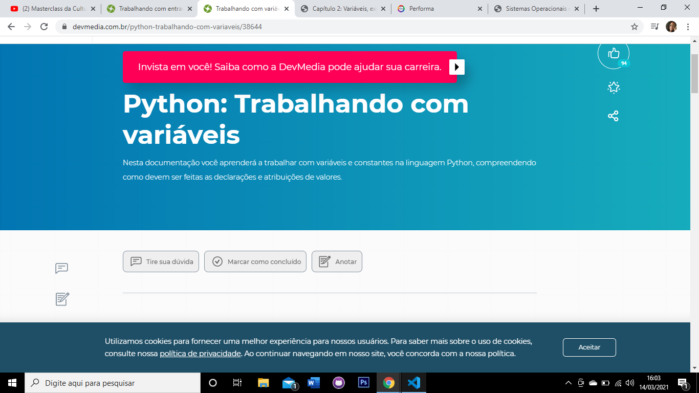

# 30daysofcode 

### Dei inicio hoje (14/03/2021) ao desafio do #30daysofcode. Desafio proposto pela facilitadora Letícia no curso VAMO AI-Resilia.

##  Comecei meu desafio me propondo a revisar todo o conteúdo visto no curso até a presente data. 

        DIA 1: 13/03/2021

* ### Comecei relendo artigos,textos e vendo os vídeos indicados no PDF da aula 1. 

* ### Completei alguns desafios proposto pelos artigos. 

a = 10

b = 5

a = b 

a = 5 

* ### Executei o código type . 

    ´´´´´ type.py
    ´´´

        DIA 2: 14/03/2021

* ### Realizei as atividades proposta no PDF aula 3 do Curso . 

    * ### Comecei a executar os exercicios do Qualified. 

